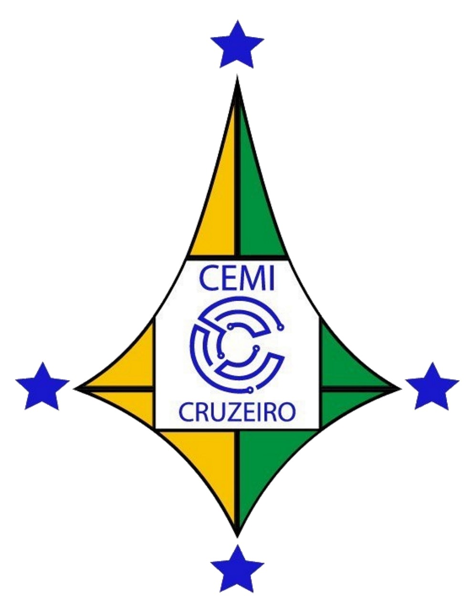
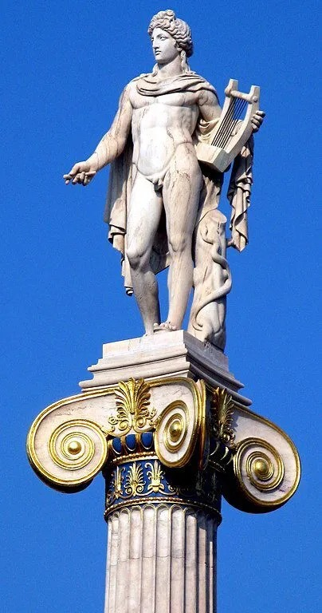
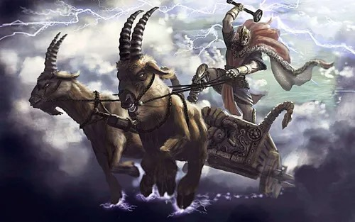

<!DOCTYPE html>
<html lang="pt-BR">
<head>
    <meta charset="UTF-8">
    <meta name="viewport" content="width=device-width, initial-scale=1.0">
    <title>Mitologia Grega e Nórdica</title>
    
</head>

<body>
    <header>
         <!-- Logo aqui -->
        <h1>Mitologia Grega e Nórdica</h1>
    </header>
    

        

            <h2>Mitologia Grega: Apolo</h2>
            
A mitologia grega é uma rica tapeçaria de histórias que explicam a origem do mundo, as divindades, heróis e as forças da natureza. Um dos deuses mais centrais dessa mitologia é Apolo, o deus da luz, da música, da poesia e da profecia. Ele é frequentemente retratado como um jovem belo, de pele clara e cabelos longos, tocando sua lira e iluminando o mundo com sua luz.

            
Filho de Zeus e Leto, Apolo é irmão gêmeo de Ártemis, a deusa da caça. Desde jovem, Apolo se destacou em várias disciplinas, incluindo a música e a adivinhação. Um de seus papéis mais importantes é como o oráculo de Delfos, onde os mortais buscavam sabedoria e previsões. Os cultos dedicados a ele eram comuns, e seu nome está associado a várias cidades gregas, simbolizando a civilização e a ordem.

            

                
            

        

        

            <h2>Mitologia Nórdica: Thor</h2>
            
A mitologia nórdica é uma rica coleção de lendas sobre deuses, heróis e seres míticos, refletindo a vida e os valores dos povos escandinavos. Thor, o deus do trovão, é um dos personagens mais populares. Ele é conhecido por sua força indomável, coragem e proteção dos humanos contra as forças do caos e do mal. Sua imagem é frequentemente associada a relâmpagos e tempestades, e ele é o defensor da ordem cósmica.

            
Thor é filho de Odin, o deus supremo, e sua mãe é a gigante Jörð. Ele é frequentemente representado com seu martelo, Mjölnir, que não apenas simboliza a guerra, mas também a fertilidade e a proteção. Thor é conhecido por suas aventuras, onde enfrenta gigantes e monstros, sempre defendendo a humanidade. Sua bravura e lealdade o tornaram uma figura emblemática da mitologia nórdica e um símbolo de força e resiliência.

            

                
            

        

        

            <h2>Nossa Missão</h2>
            
O intuito deste site é informar as pessoas sobre as diversas religiões e mitologias ao redor do mundo, promovendo o entendimento e o respeito mútuo. A educação é uma ferramenta poderosa que pode ajudar a diminuir a discriminação religiosa, permitindo que todos reconheçam a riqueza das crenças e tradições de outras culturas.

            
Ao aprender sobre a mitologia grega, nórdica e outras crenças, podemos apreciar a diversidade da experiência humana e construir um mundo mais inclusivo, onde cada indivíduo é respeitado por suas crenças. Juntos, podemos trabalhar para erradicar preconceitos e promover a harmonia entre todos.

        

        

            <h2>Fontes dos Textos</h2>
            
As informações contidas neste site foram coletadas de diversas fontes respeitáveis, incluindo livros clássicos sobre mitologia, estudos acadêmicos e artigos especializados. Alguns exemplos incluem:

            <ul>
                <li>"Mitologia Grega" de Robert Graves</li>
                <li>"Os Deuses da Mitologia Nórdica" de H. A. Guerber</li>
                <li>"A Lira de Apolo: Música e Poesia na Antiguidade" de Andrew Barker</li>
                <li>"Mitologia Nórdica" de Neil Gaiman</li>
                <li>Artigos acadêmicos de revistas especializadas em estudos religiosos e culturais.</li>
            </ul>
            
Essas fontes ajudam a garantir que as narrativas e informações apresentadas sejam precisas e reflitam a rica herança cultural dessas tradições.

        

        

            <h2>Participantes do Grupo</h2>
            
Lívia Oliveira dos Santos 1_A

            
Enzo 1_A

            
Guilherme Silva Lopes 2_A

            
Professor Conselheiro: Professor André

        

    

    <footer>
        
&copy; 2024 Mitologia Grega e Nórdica

    </footer>
</body>
</html>
